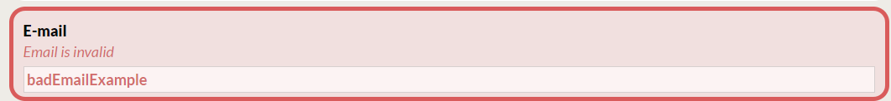
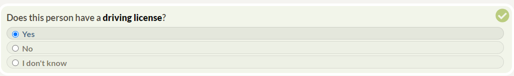
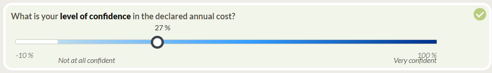

# Generator

## Why Generator?

The Generator is designed to simplify and expedite your workflow. It allows for quick and easy corrections, reducing the time spent on repetitive tasks. Our primary goal is to make the creation of transit surveys as straightforward as possible. By automating the generation of survey components, we are not only enhancing productivity and efficiency, but also contributing to the implementation of sustainable practices in transportation. This tool is part of our commitment to promoting sustainable development within the transport sector.

## Table of Contents

- [Why Generator?](#why-generator)
- [How to Run?](#how-to-run)
- [Generate Excel](#generate-excel)
- [Generate Widgets](#generate-widgets)
  - [Widgets Fields](#widgets-fields)
  - [Widgets Example](#widgets-example)
- [Generate Conditionals](#generate-conditionals)
  - [Conditionals Fields](#conditionals-fields)
  - [Conditionals Example](#conditionals-example)
- [Generate Choices](#generate-choices)
  - [Choices Fields](#choices-fields)
  - [Choices Example](#choices-example)
- [Generate InputRange](#generate-inputrange)
  - [InputRange Fields](#inputrange-fields)
  - [InputRange Example](#inputrange-example)
- [Generate Libelles](#generate-libelles)
  - [Libelles Fields](#libelles-fields)
  - [Libelles Example](#libelles-example)

## How to Run?

To run this script, follow these steps:

1. Copy `generateSurveyExample.xlsx` to your project.

   For Windows users:

   ```bash
   cd projectName
   copy ./evolution/generator/example/generateSurveyExample.xlsx ./survey/src/survey/references/generateSurveyExample.xlsx
   ```

   For Linux and Mac users:

   ```bash
   cd projectName
   cp ./evolution/generator/example/generateSurveyExample.xlsx ./survey/src/survey/references/generateSurveyExample.xlsx
   ```

2. Copy `generatorConfig.yaml` to your project.

   For Windows users:

   ```bash
   cd projectName
   copy ./evolution/generator/example/generatorConfig.yaml ./survey/src/survey/config/generatorConfig.yaml
   ```

   For Linux and Mac users:

   ```bash
   cd projectName
   cp ./evolution/generator/example/generatorConfig.yaml ./survey/src/survey/config/generatorConfig.yaml
   ```

3. Navigate to the root folder of your project and run the following command:

   ```bash
   yarn generateSurvey
   ```

## Generate Excel

This step is optional but can greatly improve your workflow if you're frequently updating your project's Excel document. By using Microsoft 365 Cloud, you can avoid the need to manually upload your document every time you make a change. Here's how you can set it up:

1. Make sure the `generatorConfig.yaml` has the correct settings.

   ```YAML
   excel:
       active_script: true
   ```

2. Copy the `generateSurveyExample.xlsx` to your own Microsoft 365 Cloud.

3. Update the `.env` file with the correct environment variables.

   ```properties
   # Download Excel file with Office365 and Sharepoint
   SHAREPOINT_URL = "https://polymtlca0-my.sharepoint.com/personal/<your_email_polymtl_ca>/"
   EXCEL_FILE_PATH = "/personal/<your_email_polymtl_ca>/Documents/<folderName>/<yourExcelName>.xlsx"
   OFFICE365_USERNAME_EMAIL = "<yourOffice365UsernameEmail>"
   OFFICE365_PASSWORD = "<yourOffice365Password>"
   ```

## Generate Widgets

Widgets are the building blocks of your survey. They define the structure and interaction of your survey questions, providing a dynamic and engaging experience for respondents. The `Widgets` tab in Excel is used to generate these widgets in the `widgets.tsx` file. Each row in the `Widgets` tab corresponds to a widget in your survey.

### Widgets Fields

| Field                | Description                                             | Type    |
| -------------------- | ------------------------------------------------------- | ------- |
| questionName         | Name of the question                                    | string  |
| [inputType](#input)  | Type of input for the question                          | string  |
| active               | Widget activation status                                | boolean |
| section              | Section to which the question belongs                   | string  |
| path                 | Path of the responses object for the question           | string  |
| fr                   | French label for the question                           | string  |
| en                   | English label for the question                          | string  |
| [conditional](#cond) | Conditional logic for displaying the widget (optional)  | string? |
| [validation](#val)   | Validation logic for the widget (optional)              | string? |
| [choices](#choices)  | Choices for the InputRadio and InputCheckbox (optional) | string? |
| [inputRange](#range) | Input range name for InputRange (optional)              | string? |
| comments             | Additional comments for the question (optional)         | string? |

> <span id="input">**Note:**</span> The `inputType` field specifies the type of input for the question and can be one of the following: Checkbox, Custom, NextButton, Number, Radio, Range, String, Text, or TextArea.

> <span id="cond">**Note:**</span> The `conditional` field allows you to define conditional logic for displaying the widget based on other responses. For example, you can specify a condition like `nbPersonnesSeptPlusConditional` to show the widget only if the number of people is 7 or more.

> <span id="val">**Note:**</span> The `validation` field is optional and allows you to define validation logic for the widget. In the example, `moreOrEqualTo7Validation` signifies that the widget will be considered valid if the entered value is equal to or greater than 7.

> <span id="choices">**Note:**</span> The `choices` field is optional, but relevant for `Radio` and `Checkbox` inputs and allows you to specify the available choices for the question.

> <span id="range">**Note:**</span> The `inputRange` field is optional and allows you to define the valid range of values for `Range` input.

### Widgets Example

In this example, we define a widget for the question `end_email`. This widget is an active InputString, and the path to the responses object for the question is `end.email`. The French and English labels for the question, the conditional logic for displaying the widget, and the validation logic are also provided. The corresponding TypeScript code and a visual representation of this widget are shown below:

| questionName | inputType | active | section | path      | fr               | en             | conditional                     | validation      | choices | inputRange | comments |
| ------------ | --------- | ------ | ------- | --------- | ---------------- | -------------- | ------------------------------- | --------------- | ------- | ---------- | -------- |
| end_email    | String    | TRUE   | end     | end.email | \*\*Courriel\*\* | \*\*E-mail\*\* | hasAcceptGivingEmailConditional | emailValidation |         |            |          |

```typescript
// end/widgets.tsx
export const end_email: inputTypes.InputString = {
  ...defaultInputBase.inputStringBase,
  path: "end.email",
  label: (t: TFunction) => t("end:end.email"),
  conditional: customConditionals.hasAcceptGivingEmailConditional,
  validations: validations.emailValidation,
};
```



## Generate Conditionals

In your survey logic, conditionals play a key role in determining if the widget will appear or not. The table below outlines the fields used to define conditionals in Conditionals tab, along with an example and the corresponding TypeScript code.

### Conditionals Fields

| Field                        | Description                                 | Type                    |
| ---------------------------- | ------------------------------------------- | ----------------------- |
| conditional_name             | Name of the conditional                     | string                  |
| logical_operator             | Logical operator (optional)                 | && or \|\|              |
| path                         | Path to the responses object for comparison | string                  |
| [comparison_operator](#comp) | Operator for comparison                     | ===, ==, >, <, >= or <= |
| value                        | Value for the comparison                    | number or string        |
| [parentheses](#par)          | Parentheses (optional)                      | ( or )                  |

> <span id="comp">**Note:**</span> The `comparison_operator` field helps compare respondent responses with the specified value. It determines how the respondent's answer should be evaluated in the conditional logic. For example, `>=` signifies that the condition is true when path responses is greater than or equal to the value.

> <span id="par">**Note:**</span> The `parentheses` field is optional and allows you to add priority to the conditional logic by using opening and closing parentheses. This is useful for specifying the order in which conditions should be evaluated. For example, you can use parentheses to create complex conditions like `conditional1 || (conditional2 && conditional3)`, where `conditional2 && conditional3` is evaluated first due to the parentheses.

### Conditionals Example

In this example, we are creating a conditional named `hasDrivingLicenseConditional`. This conditional checks if the age of the person is 16 or older and if the person has a driving license. The table below shows the fields and their corresponding values for this conditional.

| conditional_name             | logical_operator | path                                   | comparison_operator | value | parentheses |
| ---------------------------- | ---------------- | -------------------------------------- | ------------------- | ----- | ----------- |
| hasDrivingLicenseConditional |                  | [${relativePath}](#rel).age            | >=                  | 16    |             |
| hasDrivingLicenseConditional | &&               | [${relativePath}](#rel).drivingLicense | ===                 | yes   |             |

> <span id="rel">**Note:**</span> `${relativePath}` in `path` is used to obtain the relative path within the same group, facilitating the reference to responses object that share a common parent or group with the current widget.

The corresponding TypeScript code for this conditional is shown below:

```typescript
// customConditionals.tsx
export const hasDrivingLicenseConditional: Conditional = (interview, path) => {
  const relativePath = path.substring(0, path.lastIndexOf(".")); // Remove the last key from the path
  return checkConditionals({
    interview,
    conditionals: [
      {
        path: `${relativePath}.age`,
        comparisonOperator: ">=",
        value: 16,
      },
      {
        logicalOperator: "&&",
        path: `${relativePath}.drivingLicense`,
        comparisonOperator: "===",
        value: "yes",
      },
    ],
  });
};
```

## Generate Choices

Choices in your survey define the available options in ­­`InputRadio` or `InputCheckbox` for respondents. The table below outlines the fields in Choices tab used to define choices, along with an example and the expected output in a ­`choices.tsx­` file.

### Choices Fields

| Field                        | Description                                           | Type             |
| ---------------------------- | ----------------------------------------------------- | ---------------- |
| choicesName                  | Name for the choices group                            | string           |
| value                        | Unique value for the choice                           | string or number |
| fr                           | French label for the choice                           | string or number |
| en                           | English label for the choice                          | string or number |
| [spreadChoicesName](#spread) | Spreading another choicesName (optional)              | string?          |
| conditional                  | Conditional name for displaying the choice (optional) | string?          |

> <span id="spread">**Note:**</span> The `spreadChoicesName` field is useful to avoid repetition. If you are using the same choices as another `choicesName`, you can specify the existing `choicesName` in `spreadChoicesName` to reuse the choices without duplicating them.

### Choices Example

In this example, we define two sets of choices: `yesNoChoices` and `yesNoDontKnowChoices`. The `yesNoChoices` set includes two options: "yes" and "no". The `yesNoDontKnowChoices` set extends the `yesNoChoices` set by adding an additional option: "don't know". This demonstrates how you can reuse and extend choice sets to create more complex selections. The corresponding TypeScript code and a visual representation of these choices are shown below:

| choicesName          | value    | fr             | en           | spreadChoicesName | conditional |
| -------------------- | -------- | -------------- | ------------ | ----------------- | ----------- |
| yesNoChoices         | yes      | Oui            | Yes          |                   |             |
| yesNoChoices         | no       | Non            | No           |                   |             |
| yesNoDontKnowChoices |          |                |              | yesNoChoices      |             |
| yesNoDontKnowChoices | dontKnow | Je ne sais pas | I don't know |                   |             |

```typescript
// choices.tsx
export const yesNoChoices: Choices = [
  {
    value: "yes",
    label: {
      fr: "Oui",
      en: "Yes",
    },
  },
  {
    value: "no",
    label: {
      fr: "Non",
      en: "No",
    },
  },
];

export const yesNoDontKnowChoices: Choices = [
  ...yesNoChoices,
  {
    value: "dontKnow",
    label: {
      fr: "Je ne sais pas",
      en: "I don't know",
    },
  },
];
```




## Generate InputRange

The `InputRange` tab in Excel is used to generate slider components in the `inputRange.tsx` file. These sliders allow users to select a value within a specified range. The table provided in the example below will generate the corresponding TypeScript code, defining the `confidentInputRange` object in `inputRange.tsx`.

### InputRange Fields

| Field          | Description                                 | Type   |
| -------------- | ------------------------------------------- | ------ |
| inputRangeName | Name of the input range                     | string |
| labelMin_fr    | French label for the minimum value          | string |
| labelMax_fr    | French label for the maximum value          | string |
| labelMin_en    | English label for the minimum value         | string |
| labelMax_en    | English label for the maximum value         | string |
| minValue       | Minimum numerical value for the input range | number |
| maxValue       | Maximum numerical value for the input range | number |
| unit_fr        | Unit in French                              | string |
| unit_en        | Unit in English                             | string |

### InputRange Example

In this example, we define an InputRange named `confidentInputRange`. This InputRange allows users to select a value representing their confidence level, ranging from "Not at all confident" to "Very confident". The corresponding TypeScript code and a visual representation of this InputRange are shown below:

| inputRangeName      | labelMin_fr          | labelMax_fr   | labelMin_en          | labelMax_en    | minValue | maxValue | unit_fr | unit_en |
| ------------------- | -------------------- | ------------- | -------------------- | -------------- | -------- | -------- | ------- | ------- |
| confidentInputRange | Pas du tout confiant | Très confiant | Not at all confident | Very confident | -10      | 100      | %       | %       |

```typescript
// inputRange.tsx
export const confidentInputRange = {
  labels: [
    {
      fr: "Pas du tout confiant",
      en: "Not at all confident",
    },
    {
      fr: "Très confiant",
      en: "Very confident",
    },
  ],
  minValue: -10,
  maxValue: 100,
  formatLabel: (value, language) => {
    return value + " " + (language === "fr" ? "%" : "%");
  },
};
```



## Generate Libelles

<!-- TODO: Modify the generateLibelles.py and documentation to support en_cati, en_one, en_cati_one, fr_cati, etc. -->

In the context of your survey logic, libelles (labels) play a crucial role in presenting questions to respondents in different languages. This Excel table below outlines the fields in `Widgets` tab used to define libelles, along with an example and the expected output in a `introduction.yml` file.

### Libelles Fields

| Field   | Description                           | Type   |
| ------- | ------------------------------------- | ------ |
| path    | Path of the responses                 | string |
| section | Section to which the question belongs | string |
| fr      | French libelle                        | string |
| en      | English libelle                       | string |

### Libelles Example

In this example, we define a libelle for the question `introduction.whichOrganization`. Libelles are used to present questions to respondents in different languages. In this case, we provide translations for both French and English. The text within the double asterisks `**` will be displayed in bold. The corresponding YAML output for the English translation is also shown.

| path                           | section      | fr                                                                 | en                                                                |
| ------------------------------ | ------------ | ------------------------------------------------------------------ | ----------------------------------------------------------------- |
| introduction.whichOrganization | introduction | À quelle [\*\*organisation\*\*](#asterisks) êtes-vous affilié(e) ? | Which [\*\*organization\*\*](#asterisks) are you affiliated with? |

> <span id="asterisks">**Note:**</span> Libelle between double asterisks `**` will be displayed in bold font.

```yaml
# en/introduction.yml
introduction.whatOrganization: Which <strong>organization</strong> are you affiliated with?
```
