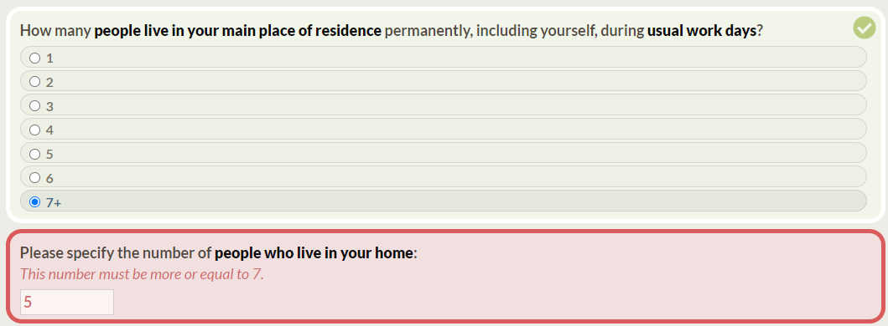

# Generator

## Table of Contents

- [How to Run the Script](#how-to-run-the-script)
- [Generate Widgets](#generate-widgets)
  - [Widgets Fields](#widgets-fields)
  - [Widgets TypeScript](#widgets-typescript)
  - [Widgets Example](#widgets-example)
- [Generate Conditionals](#generate-conditionals)
  - [Conditionals Fields](#conditionals-fields)
  - [Conditionals TypeScript](#conditionals-typescript)
- [Generate Choices](#generate-choices)
  - [Choices Fields](#choices-fields)
  - [Choices TypeScript](#choices-typescript)
  - [Choices Example](#choices-example)
- [Generate InputRange](#generate-inputrange)
  - [InputRange Fields](#inputrange-fields)
  - [InputRange TypeScript](#inputrange-typescript)
  - [InputRange Example](#inputrange-example)
- [Generate Libelles](#generate-libelles)
  - [Libelles Fields](#libelles-fields)
  - [Libelles YAML](#libelles-yaml)

## How to Run the Script

To run this script, follow these steps:

1. Create an Excel file following this example : [Enquete_Teletravail_Generate_survey](https://polymtlca0-my.sharepoint.com/:x:/g/personal/samuel_duhaime-morissette_polymtl_ca/Ecp5FW8DQ5JFiYDEMCOb9PMBSUUbxdsaFq4_ncT5oxchWw?e=jsdIJt).
2. Update the `.env` file with the necessary environment variables.

    ```properties
    # Download Excel file with Office365 and Sharepoint
    SHAREPOINT_URL = "https://polymtlca0-my.sharepoint.com/personal/<your_name>_polymtl_ca/"
    EXCEL_FILE_PATH = "/personal/<your_name>_polymtl_ca/Documents/<your_folder_name>/<your_excel_file_name>.xlsx"
    OFFICE365_USERNAME_EMAIL = "<your_office365_username_email>"
    OFFICE365_PASSWORD = "<your_office365_password>"
    ```

3. Update `generatorConfig.yaml` with the correct settings.
4. Navigate to the root folder of the project and run the following command:

    ```bash
    yarn generateSurvey
    ```

## Generate Widgets

In your survey logic, widgets define the various elements that make up your survey questions, providing the structure and interaction for respondents. The table below outlines the fields used to define widgets in the `Widgets` tab, along with an example of generating TypeScript code in `widgets.tsx`.

### Widgets Fields

| Field               | Description                                             | Example                                                                       | Type                 |
|---------------------|---------------------------------------------------------|-------------------------------------------------------------------------------|----------------------|
| questionName        | Name of the question                                    | home_Q2_nbPersonnesResidenceTravailPreciser                                   | string               |
| [inputType](#input) | Type of input for the question                          | Number                                                                        | string               |
| active              | Widget activation status                                | TRUE                                                                          | boolean              |
| section             | Section to which the question belongs                   | home                                                                          | string               |
| path                | Path to the data point for the question                 | home.Q2_nbPersonnesResidenceTravailPreciser                                   | string               |
| fr                  | French label for the question                           | Veuillez préciser le nombre de \*\*personnes qui habitent votre domicile\*\*: | string               |
| en                  | English label for the question                          | Please specify the number of \*\*people who live in your home\*\*:            | string               |
| [conditional](#cond)| Conditional logic for displaying the widget (optional)  | nbPersonnesSeptPlusConditional                                                | string?              |
| [validation](#val)  | Validation logic for the widget (optional)              | moreOrEqualTo7Validation                                                      | string?              |
| [choices](#choices) | Choices for the InputRadio and InputCheckbox (optional) |                                                                               | string?              |
| [inputRange](#range)| Input range name for InputRange (optional)              |                                                                               | string?              |
| comments            | Additional comments for the question (optional)         | If number of persons = 7+                                                     | string?              |

> <span id="input">**Note:**</span> The `inputType` field specifies the type of input for the question and can be one of the following: Checkbox, Custom, NextButton, Number, Radio, Range, String, Text, or TextArea.

> <span id="cond">**Note:**</span> The `conditional` field allows you to define conditional logic for displaying the widget based on other responses. For example, you can specify a condition like `nbPersonnesSeptPlusConditional` to show the widget only if the number of people is 7 or more.

> <span id="val">**Note:**</span> The `validation` field is optional and allows you to define validation logic for the widget. In the example, `moreOrEqualTo7Validation` signifies that the widget will be considered valid if the entered value is equal to or greater than 7.

> <span id="choices">**Note:**</span> The `choices` field is optional, but relevant for `Radio` and `Checkbox` inputs and allows you to specify the available choices for the question.

> <span id="range">**Note:**</span> The `inputRange` field is optional and allows you to define the valid range of values for `Range` input.

### Widgets TypeScript

```typescript
// home/widgets.tsx
export const home_Q2_nbPersonnesResidenceTravailPreciser: inputTypes.InputString = {
    ...defaultInputBase.inputNumberBase,
    path: 'home.Q2_nbPersonnesResidenceTravailPreciser',
    label: (t: TFunction) => t('home:home.Q2_nbPersonnesResidenceTravailPreciser'),
    conditional: customConditionals.nbPersonnesSeptPlusConditional,
    validations: validations.moreOrEqualTo7Validation
};
```

### Widgets Example


## Generate Conditionals

In your survey logic, conditionals play a key role in determining if the widget will appear or not. The table below outlines the fields used to define conditionals in Conditionals tab, along with an example and the corresponding TypeScript code.

### Conditionals Fields

| Field                       | Description                            | Example                       | Type                    |
|-----------------------------|----------------------------------------|-------------------------------|-------------------------|
| conditionalName             | Name of the conditional                | siPermisConduireConditional   | string                  |
| logicalOperator             | Logical operator (optional)            | &&                            | && or \|\|              |
| path                        | Path to the data point for comparison  | [${relativePath}](#rel).age   | string                  |
| [comparisonOperator](#comp) | Operator for comparison                | >=                            | ===, ==, >, <, >= or <= |
| value                       | Value for the comparison               | 16                            | number or string        |
| [parentheses](#par)         | Parentheses (optional)                 |                               | ( or )                  |

> <span id="comp">**Note:**</span> The `comparisonOperator` field helps compare respondent responses with the specified value. It determines how the respondent's answer should be evaluated in the conditional logic. In this example, `>=` signifies that the condition is true when `person.age` is greater than or equal to 16.

> <span id="par">**Note:**</span> The `parentheses` field is optional and allows you to add priority to the conditional logic by using opening and closing parentheses. This is useful for specifying the order in which conditions should be evaluated. For example, you can use parentheses to create complex conditions like `conditional1 || (conditional2 && conditional3)`, where `conditional2 && conditional3` is evaluated first due to the parentheses.

> <span id="rel">**Note:**</span> `${relativePath}` in `path` is used to obtain the relative path within the same group, facilitating the reference to data points that share a common parent or group with the current data point being processed in the TypeScript code for generating conditionals.

### Conditionals TypeScript

```typescript
// customConditionals.tsx

// In this example, the age of the person is equal or more than 16 and the person have a driving license 
export const siPermisConduireConditional: Conditional = (interview, path) => {
    const relativePath = path.substring(0, path.lastIndexOf('.')); // Remove the last key from the path
    return checkConditionals({
        interview,
        conditionals: [
            {
                path: `${relativePath}.age`,
                comparisonOperator: '>=',
                value: 16,
            },
            {
                logicalOperator: '&&',
                path: `${relativePath}.permisConduire`,
                comparisonOperator: '===',
                value: 'oui',
            }
        ]
    });
};
```

## Generate Choices

Choices in your survey define the available options in ­­`RadioInput` or `InputCheckbox` for respondents. The table below outlines the fields in Choices tab used to define choices, along with an example and the expected output in a ­`choices.tsx­` file.

### Choices Fields

| Field                        | Description                                            | Example        | Type             |
|------------------------------|--------------------------------------------------------|----------------|------------------|
| choicesName                  | Name for the choices group                             | ouiNonChoices  | string           |
| value                        | Unique value for the choice                            | oui            | string or number |
| fr                           | French label for the choice                            | Oui            | string or number |
| en                           | English label for the choice                           | Yes            | string or number |
| [spreadChoicesName](#spread) | Spreading another choicesName (optional)               |                | string?          |
| conditional                  | Conditional name for displaying the choice (optional)  |                | string?          |

> <span id="spread">**Note:**</span> The `spreadChoicesName` field is useful to avoid repetition. If you are using the same choices as another `choicesName`, you can specify the existing `choicesName` in `spreadChoicesName` to reuse the choices without duplicating them.

### Choices TypeScript
```typescript
// choices.tsx
export const ouiNonChoices: Choices = [
    {
        value: 'oui',
        label: {
            fr: 'Oui',
            en: 'Yes'
        }
    },
    {
        value: 'non',
        label: {
            fr: 'Non',
            en: 'No'
        }
    }
];
```

### Choices Example


## Generate InputRange

In Excel, the `InputRange` tab generates sliders in `inputRange.tsx`. The provided table example will generate the following TypeScript code, defining the `confiantInputRange` object in `inputRange.tsx`.

### InputRange Fields

| Field          | Description                                     | Example                 | Type        |
|----------------|-------------------------------------------------|-------------------------|-------------|
| inputRangeName | Name of the input range                         | confiantInputRange      | string      |
| labelFrMin     | French label for the minimum value              | Pas du tout confiant    | string      |
| labelFrMax     | French label for the maximum value              | Très confiant           | string      |
| labelEnMin     | English label for the minimum value             | Not at all confident    | string      |
| labelEnMax     | English label for the maximum value             | Very confident          | string      |
| minValue       | Minimum numerical value for the input range     | -10                     | number      |
| maxValue       | Maximum numerical value for the input range     | 100                     | number      |
| unitFr         | Unit in French                                  | %                       | string      |
| unitEn         | Unit in English                                 | %                       | string      |

### InputRange TypeScript

```typescript
// inputRange.tsx
export const confiantInputRange = {
    labels: [
        {
            fr: 'Pas du tout confiant',
            en: 'Not at all confident'
        },
        {
            fr: 'Très confiant',
            en: 'Very confident'
        }
    ],
    minValue: -10,
    maxValue: 100,
    formatLabel: (value, language) => {
        return value + ' ' + (language === 'fr' ? '%' : '%');
    }
};
```
### InputRange Example


## Generate Libelles

In the context of your survey logic, libelles (labels) play a crucial role in presenting questions to respondents in different languages. This Excel table below outlines the fields in `Widgets` tab used to define libelles, along with an example and the expected output in a `introduction.yml` file.

### Libelles Fields

| Field       | Description          | Example                                                           | Type   |
|-------------|----------------------|-------------------------------------------------------------------|--------|
| path        | Path to the question | introduction.Q1_quelleOrganisation                                | string |
| fr          | French libelle       | À quelle [\*\*organisation\*\*](#asterisks) êtes-vous affilié(e) ?| string |
| en          | English libelle      | Which [\*\*organization\*\*](#asterisks) are you affiliated with? | string |

> <span id="asterisks">**Note:**</span> Libelle between double asterisks `**` will be displayed in bold font.

### Libelles YAML

```yaml
# en/introduction.yml
introduction.Q1_quelleOrganisation: Which <strong>organization</strong> are you affiliated with?
```